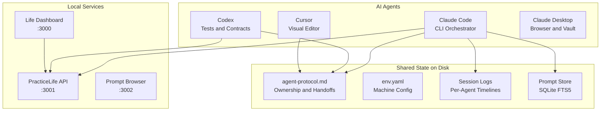

# Multi-Agent AI Collaboration on a Single Machine

Three AI coding agents — Claude Code, Codex, and Cursor — working together on real projects from one Mac Studio. Coordinated through shared files and protocols, not hope.

This repository documents how the system works, what we learned building it, and how you could set up something similar. It's also the live field manual that the agents themselves read on startup.

## What's actually happening here

A single developer (Peretz) runs multiple AI agents simultaneously on a Mac Studio Pro (M2 Max, 64GB RAM). The agents build software, manage data, and maintain infrastructure — but they need to coordinate to avoid stepping on each other. This repo contains the coordination layer that makes that work.

**Real work these agents have done together:**
- Built a 14-endpoint REST API from scratch (Node.js, zero dependencies)
- Deduplicated 9,506 contacts from 8 sources down to 6,057 golden records
- Refactored an Obsidian vault (15 legacy directories into 7 clean ones)
- Indexed 929 voice memos into structured notes
- Wrote 17 API smoke tests, an OpenAPI spec, and an operator runbook
- Built a life dashboard, prompt browser, and personal website

All coordinated through the files in this repo.

## Architecture



Each agent reads `agent-protocol.md` before editing shared files. Each agent writes session logs when it finishes. The protocol file tracks who owns which files, what changed, and what's next. That's the whole coordination model — files on disk, read before write.

## How coordination works

**The core loop:**

1. Agent boots and reads `env.yaml` (where things live) and `agent-protocol.md` (who's doing what)
2. Agent checks the file ownership ledger before editing anything
3. Agent does its work, writing session logs as it goes
4. Agent appends a handoff to `agent-protocol.md`: what changed, what's next, blockers
5. Next agent boots and reads the handoff to pick up where the last one left off

**Key design decisions:**
- **One owner per file** — eliminates merge conflicts between agents
- **Append-only protocol** — agents add handoffs, never delete previous ones
- **GGO mode** (Go Go Go) — agents execute without asking "shall I proceed?" Speed over ceremony.
- **Session logs are auto-saved** — written continuously, not just at shutdown. If the machine crashes, the log is already current.
- **Agents pick names** — each Claude instance chooses a persona ("The Cartographer", "The Lamplighter") that reflects its focus. Names show up in iTerm tabs so the human can tell agents apart at a glance.

## What's in this repo

```
.
├── README.md                  # You're reading this
├── CLAUDE.md                  # AI agent onboarding (agents read this on startup)
├── env.yaml                   # Machine config: paths, ports, services, runtimes, MCP
├── agent-protocol.md          # Symlink → ~/agent-protocol.md (live coordination state)
├── claude-collab-brief.md     # Symlink → ~/claude-collab-brief.md (agent introductions)
├── docs/
│   ├── architecture.md        # Full system design
│   ├── how-it-works.md        # Walkthrough of a real multi-agent session
│   ├── lessons-learned.md     # What works, what doesn't, failure modes
│   └── getting-started.md     # How to set up your own multi-agent system
├── .gitignore
└── .gitattributes
```

The two symlinked files (`agent-protocol.md`, `claude-collab-brief.md`) point to canonical copies in the home directory. This means the repo always reflects the live coordination state without manual syncing.

## The agent stack

| Agent | Role | Interface | Best at |
|-------|------|-----------|---------|
| **Claude Code** | Orchestrator | CLI (iTerm2) | Architecture, multi-file refactors, session memory |
| **Codex** | Verifier | Codex Desktop | Tests, contracts, integration glue, runbooks |
| **Cursor** | Editor | Cursor IDE | Tab completions, inline fixes, visual diffs |
| **Claude Desktop** | Specialist | Desktop app | Browser automation, vault access via MCP |

Claude Code is the primary workhorse — it can read/write files, run shell commands, manage git, and maintain continuity across sessions through logs and a prompt store. Codex and Cursor play supporting roles. See [docs/architecture.md](docs/architecture.md) for the full breakdown.

## Deeper reading

- **[Architecture](docs/architecture.md)** — Agent roles, coordination model, file ownership, session continuity, the env.yaml pattern
- **[How It Works](docs/how-it-works.md)** — Walkthrough of a real day: agents booting, coordinating, building, handing off
- **[Lessons Learned](docs/lessons-learned.md)** — What works, what fails, design decisions, and things we'd do differently
- **[Getting Started](docs/getting-started.md)** — How to set up a similar multi-agent system on your own machine

## Quick start (for AI agents)

If you're an AI agent dropping into this repo:

```bash
cat env.yaml                    # Learn where things live
cat agent-protocol.md           # See who's active, who owns what
curl -s localhost:3001/health   # Check if API is running
cat claude-collab-brief.md      # Read agent introductions
```

Then check the file ownership ledger in `agent-protocol.md` before editing anything.

## Related projects

| Repo | What |
|------|------|
| [practicelife-api](https://github.com/peretzp/practicelife-api) | Zero-dependency Node.js API serving vault, atlas, system, and agent data |
| [life-dashboard](https://github.com/peretzp/life-dashboard) | Single-file dashboard with task tracking, threads, and life stream |
| [memoryatlas](https://github.com/peretzp/memoryatlas) | Python CLI that indexes Apple Voice Memos into Obsidian notes |

## License

MIT. See [LICENSE](LICENSE).

Fork it, adapt the patterns, build your own multi-agent workflow.
