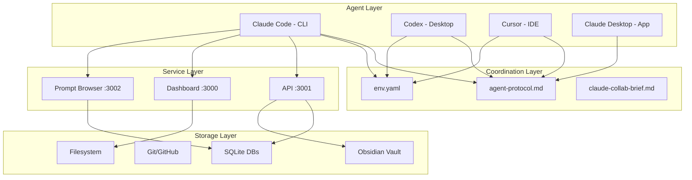
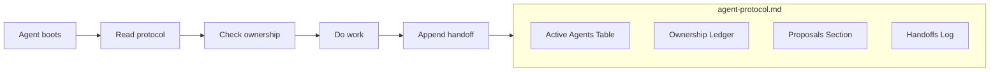
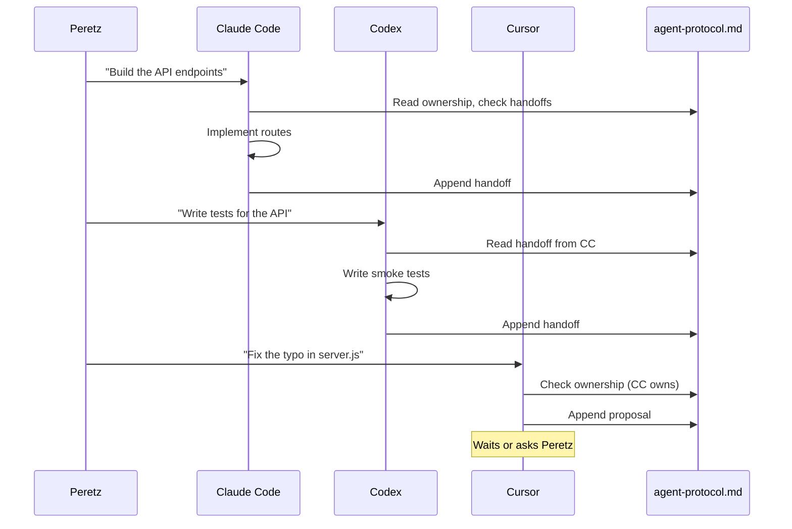

# Architecture

## Overview

This is a multi-agent AI development environment running on a single machine. Three different AI products — made by different companies, using different models — operate on the same codebase simultaneously, coordinated through shared filesystem protocols.

There is no orchestration server, no message bus, no API gateway between agents. The coordination layer is a markdown file and a YAML config. Every agent reads the same files on startup, works within its ownership boundaries, and logs its handoffs to a shared protocol file.

## The machine

```
Mac Studio Pro
├── Chip: Apple M2 Max
├── RAM: 64GB unified
├── OS: macOS Darwin 25.2.0
├── Displays: 3x 4K
├── Storage: Internal SSD + SD4Loco (external)
└── Local models: Ollama (llama3.3:70b, qwen2.5:32b, codellama:34b)
```

Most agent work is API-bound (calls to Anthropic/OpenAI), not local compute. The local Ollama models are available but not part of the core agent loop.

## Agent stack



### Claude Code (Anthropic)

- **Interface**: CLI, runs in iTerm2 terminal tabs
- **Model**: Claude Opus 4.6
- **Strengths**: Deep architectural reasoning, multi-file refactors, session continuity
- **Session memory**: Writes to `~/.claude/session-logs/`, reads on startup for continuity
- **Naming**: Each instance picks a unique name (The Record Keeper, The Cartographer, etc.)
- **Park protocol**: On shutdown, writes session log, rebuilds indexes, outputs restart instructions

### Codex (OpenAI)

- **Interface**: Desktop application
- **Model**: GPT-5.2/5.3 Codex
- **Strengths**: Fast scanning, small safe diffs, test scaffolding, contracts
- **MCP servers**: OpenAI docs, LinkedIn, Playwright
- **Limitation**: Cannot bind to local ports in sandboxed mode

### Cursor (Cursor Inc.)

- **Interface**: VS Code-based IDE
- **Model**: Various (GPT-5.2-Codex for agent mode, others for completions)
- **Strengths**: Tab completions (unlimited on Pro), visual diffs, inline edits
- **MCP servers**: Playwright, Claude Code (as MCP server)
- **Best used as**: Foreground editing tool, not a background agent

### Claude Desktop (Anthropic)

- **Interface**: Desktop application
- **Strengths**: Vault access via filesystem MCP, LinkedIn MCP, browser automation
- **MCP servers**: LinkedIn, Obsidian vault (filesystem), Playwright

## Coordination protocol

### env.yaml — Machine configuration

The single source of truth for where things live. Maps abstract resource names to concrete paths:

```yaml
paths:
  vault: "/Users/peretz_1/Library/Mobile Documents/..."
  api: "/Users/peretz_1/api"

services:
  api:
    port: 3001
    health: "http://localhost:3001/health"

repos:
  practicelife_api:
    local: "/Users/peretz_1/api"
    remote: "git@github.com:peretzp/practicelife-api.git"
```

Every agent reads this on startup. To adapt for a different machine, create `env.local.yaml` with your paths.

### agent-protocol.md — Live coordination

An append-only markdown file that serves as the shared state between all agents:



**Active Agents table**: Who's running, their name, model, status, and focus area.

**File Ownership Ledger**: Maps every shared file/directory to its owner. The owner edits freely. Non-owners propose changes by appending to the Proposals section.

**Proposals**: Structured requests to modify a file owned by another agent.

**Handoffs**: The core coordination mechanism. Every time an agent finishes a chunk of work, it appends:
- What changed (files created/modified/deleted)
- What's next (explicit next steps)
- Blockers (anything stuck)

### File ownership — the core rule

The single most important coordination mechanism: **one owner per file**.

```
~/api/routes/*     → Claude Code owns (implementations)
~/api/test/*       → Codex owns (tests)
~/api/openapi.json → Codex owns (contract)
~/api/server.js    → Claude Code owns (entrypoint)
~/.claude/         → Claude Code owns (never modify)
~/.codex/          → Codex owns (never modify)
```

This eliminates merge conflicts between agents entirely. When an agent needs to modify a file it doesn't own, it writes a proposal in `agent-protocol.md` and waits.

### Handoff format

```markdown
### [Agent Name] — [Timestamp] — [Title]
**What changed**:
- [List of changes]

**What's next**:
- [Explicit next steps]

**Blockers**:
- [Anything stuck, or "None"]
```

This format is deliberately minimal. Three sections, always the same structure. Any AI agent can parse it. Any human can scan it.

## Services

Three Node.js services run locally:

| Service | Port | Purpose | Health check |
|---------|------|---------|--------------|
| Life Dashboard | 3000 | Single-file personal dashboard | `GET /` |
| PracticeLife API | 3001 | Zero-dep API for vault, atlas, system, agents | `GET /health` |
| Prompt Browser | 3002 | Browse and search all prompts sent to AI agents | `GET /api/stats` |

All three are zero-dependency Node.js servers. No Express, no frameworks. `node server.js` and go.

## MCP (Model Context Protocol) servers

MCP extends agent capabilities with external tools:

| MCP Server | Agents | Purpose |
|------------|--------|---------|
| Playwright | Cursor, Codex, Claude Desktop | Browser automation, testing |
| LinkedIn | Codex, Claude Desktop | LinkedIn profile access |
| OpenAI Docs | Codex | Official OpenAI documentation |
| Obsidian Vault | Claude Desktop | Filesystem access to Obsidian |
| Claude Code | Cursor | Claude Code as a tool inside Cursor |

## Session continuity

Claude Code instances maintain continuity across sessions through:

1. **Session logs** (`~/.claude/session-logs/YYYY-MM-DD-descriptor.md`) — timeline of what happened
2. **Session index** (`~/.claude/session-index.db`) — SQLite FTS5 index for instant search
3. **Prompt store** (`~/.claude/prompts.db`) — every prompt sent to Claude, searchable
4. **Memory file** (`~/.claude/projects/-Users-peretz-1/memory/MEMORY.md`) — persistent facts
5. **Park protocol** — structured shutdown that writes restart instructions for the next instance

When a new Claude Code instance boots, it reads the latest session log and picks up exactly where the previous instance left off.

## Data flow



The human (Peretz) is the router. He decides which agent gets which task. Agents don't dispatch work to each other — they coordinate through the shared protocol file and let the human drive.
