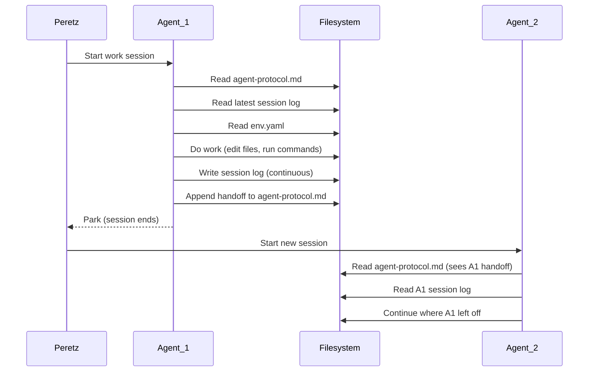

# Architecture

How multiple AI agents coordinate on a single machine without stepping on each other.

## The problem

You have three AI coding agents. Each can read files, write files, and run commands. If two agents edit the same file at the same time, you get conflicts. If they don't know what each other has done, they duplicate work or break things. If the human has to manually relay context between agents, the overhead eats the productivity gains.

The solution is a coordination layer made entirely of files on disk — no server, no database, no message queue. Just shared text files with clear ownership rules.

## Agent roles

### Claude Code (the orchestrator)

- **Interface**: CLI in iTerm2
- **Model**: Claude Opus / Sonnet via Anthropic API
- **Strengths**: Deep architectural reasoning, multi-file refactors, session memory, full shell access
- **Memory**: Writes session logs to `~/.claude/session-logs/`, maintains a prompt store (SQLite FTS5), reads/writes `MEMORY.md`
- **Concurrency**: The primary workhorse. Multiple instances can run simultaneously (each in its own iTerm tab with a unique name), but 2-3 concurrent agents is the practical sweet spot

Claude Code is the only agent with real session continuity. When an instance starts, it reads the latest session log and agent protocol to understand what happened before it existed. When it parks (shuts down), it writes a session log and handoff. This is how context persists across the ephemeral conversation windows.

### Codex (the verifier)

- **Interface**: Codex Desktop app
- **Model**: GPT-5 Codex via OpenAI
- **Strengths**: Fast scanning, targeted edits, test scaffolding, runbooks, integration glue
- **Limitations**: Cannot bind to local ports (sandboxed), cannot complete OAuth flows, UI-dependent actions need the human
- **Owns**: `~/api/test/`, `~/api/openapi.json`, `~/api/README.md`

Codex plays a supporting role focused on verification: writing tests, maintaining API contracts, keeping runbooks aligned with behavior. It coordinates with Claude Code through the agent protocol file.

### Cursor (the editor)

- **Interface**: Cursor IDE (VS Code fork)
- **Model**: GPT-5 Codex / Claude via proxy
- **Strengths**: Tab completions (unlimited on Pro plan, $0 marginal cost), Cmd+K inline edits, visual diffs, code navigation
- **Limitations**: No session memory, context truncates at ~70-120K tokens, not suitable for orchestration
- **Best for**: Quick edits (<3 files), visual inspection, tab completions while typing

Cursor is a foreground tool, not a background agent. Open it for a specific editing session, use it, close it. It doesn't need to write session logs or participate in handoffs — its value is in the moment, not across sessions.

### Claude Desktop (the specialist)

- **Interface**: Claude Desktop app
- **Strengths**: MCP integrations (LinkedIn, Obsidian vault filesystem, Playwright browser automation)
- **Best for**: Tasks requiring browser interaction, vault access through MCP, or LinkedIn data

## The coordination layer

All coordination happens through files on disk. There is no central server, no pub/sub, no RPC. Agents read files, do work, write files. The filesystem is the message bus.

### agent-protocol.md

The central coordination file. Contains:

- **Active agents table** — who's running, what they're focused on
- **Retired agents table** — historical record of completed work
- **Rules of engagement** — read before editing, one owner per file, no parallel edits, handoff format
- **File ownership ledger** — which agent owns which files
- **Proposals** — agents suggest changes to files they don't own
- **Handoffs** — append-only log of what each agent did, what's next, and what's blocked

This file is the closest thing to a "state machine" in the system. Every agent reads it on startup. Every agent appends to it on shutdown. The handoffs section is an append-only log that preserves the full history of agent coordination.

### env.yaml

Machine-specific configuration. Maps abstract names to concrete paths:

```yaml
paths:
  vault: "/Users/peretz_1/Library/Mobile Documents/iCloud~md~obsidian/Documents/PracticeLife"
  api: "/Users/peretz_1/api"
  dashboard: "/Users/peretz_1/life-dashboard"

services:
  api:
    port: 3001
    health: "http://localhost:3001/health"

runtimes:
  python: "3.11"
  node: "v24.7.0"
```

This is the single source of truth for "where things live." When the system moves to a different machine, only this file changes. Agents read it instead of hardcoding paths.

The `env.local.yaml` pattern allows machine-specific overrides without touching the committed config.

### Session logs

Each Claude Code instance writes a session log to `~/.claude/session-logs/` with the format `YYYY-MM-DD-descriptor.md`. Logs contain:

- Timeline of what the agent did
- Files created, modified, and deleted
- Decisions made and why
- Current tasks, blockers, and remaining work

Logs are written continuously (auto-save), not just at shutdown. If the machine crashes, the log is already current. This is critical — a log that only gets written at park time is a log that gets lost when context fills up.

### Prompt store

A SQLite database with FTS5 (full-text search) at `~/.claude/prompts.db`. Indexes every prompt the human sends to Claude Code. Each record contains: content, content SHA, agent/model, session ID, timestamp, git branch, working directory.

This enables searching across all past conversations — "when did I last ask about X?" — without needing to find the right session log.

## The ownership model

Every file or directory has exactly one owner. The owner edits freely. Non-owners must propose changes through `agent-protocol.md`.

```
~/api/routes/*     → Claude Code (route implementations)
~/api/test/*       → Codex (smoke tests)
~/api/openapi.json → Codex (API contract)
~/api/server.js    → Claude Code (server entrypoint)
~/life-dashboard/  → Claude Code
~/.claude/         → Claude Code (never modify from other agents)
~/.codex/          → Codex (never modify from other agents)
```

This eliminates merge conflicts entirely. Two agents never edit the same file at the same time because they can't — the protocol forbids it. When an agent needs to change a file it doesn't own, it writes a proposal and the owner handles it.

In practice, this means Claude Code builds the API routes and Codex writes the tests for them. They share the same codebase but never touch each other's files without coordination.

## The handoff protocol

When an agent finishes a work session, it appends a handoff to `agent-protocol.md`:

```markdown
### The Cartographer — 2026-02-08T18:45:00 — Vault Refactor COMPLETE

**What changed**:
- Merged 15 legacy directories into ACE+PARA structure
- Sorted 48 files from 0_Inbox into proper locations
- Vault now has exactly 7 clean top-level dirs

**What's next**:
1. SDI Appeal — CRITICAL, no agent has started
2. MemoryAtlas Phase 2 — Whisper transcription

**Blockers**: None
```

The next agent that boots reads this handoff and knows exactly where things stand. No human relay needed. The handoff log is append-only — the full history of agent coordination is preserved.

## The naming convention

Each Claude Code instance picks a unique persona name on startup: "The Record Keeper", "The Cartographer", "The Lamplighter", "The Collector". The name reflects the instance's focus and gets set as the iTerm tab title.

This serves two purposes:
1. **Human identification** — Peretz can look at iTerm tabs and instantly know which agent is doing what
2. **Log disambiguation** — session logs and handoffs are attributed to names, not anonymous instance IDs

Over 20 named instances have operated in this system. The retired agents table in `agent-protocol.md` preserves the full historical record.

## Service architecture

Three local Node.js services run on the machine:

| Service | Port | Purpose |
|---------|------|---------|
| Life Dashboard | 3000 | Task tracking, threads, life stream, plan execution |
| PracticeLife API | 3001 | REST API for vault, atlas, system, and agent data |
| Prompt Browser | 3002 | Web UI for searching the prompt store |

All three are zero-dependency Node.js HTTP servers. The API reads from SQLite databases (MemoryAtlas, session index, prompt store) and the Obsidian vault filesystem. The dashboard and prompt browser consume the API.

## MCP (Model Context Protocol)

MCP servers extend agent capabilities:

| MCP Server | Agent | Purpose |
|------------|-------|---------|
| Playwright | Cursor, Codex, Claude Desktop | Browser automation |
| LinkedIn | Codex, Claude Desktop | LinkedIn data access |
| Obsidian vault | Claude Desktop | Direct vault filesystem access |
| OpenAI Docs | Codex | Official OpenAI documentation |
| Claude Code MCP | Cursor | Cursor can invoke Claude Code |

MCP configurations are per-agent, defined in `env.yaml` under the `mcp` key.

## Data flow: how state persists across agent lifetimes



The filesystem is the only durable medium. Conversation windows are ephemeral — when an agent runs out of context or crashes, the conversation is gone. But the files it wrote to disk remain. The next agent reads those files and continues.

This is the first principle of the system: **the machine is the context, not the conversation.**
